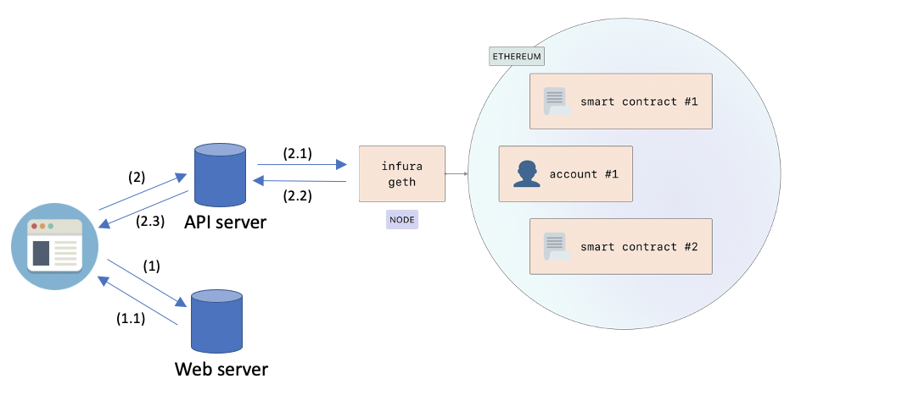

# Visualizzazione della blockchain di Ethereum

Questo repository contiene il codice relativo al progetto svolto da Andrea Mariani e Gianluca Mariani,
relativo al corso di [Visualizzazione delle informazioni](http://www.dia.uniroma3.it/~infovis/index.php),
tenuto dal prof. [Maurizio Patrignani](https://compunet.ing.uniroma3.it/#!/people/titto),
nell'anno accademico 2020-2021.

## Accesso al repository 

Per effettuare il download del repository:

    git clone https://github.com/Gianlucamariani1996/infovis-progetto-finale.git

## Organizzazione del repository 

Questo repository è organizzato in due sezioni (cartelle):
* [back-end](back-end/): contenente un file python che implementa un API server il quale mette a disposizione il seguente end-point `GET /generate-tree?block={block}&height={height}`, quest'ultimo permette di costruire un albero di altezza specificata a partire dal numero di blocco dato;
* [front-end](front-end/): contenente i file relativi al sistema di visualizzazione.

## Architettura:

## Obiettivi

L'obiettivo di questo progetto è stato quello di sviluppare un sistema di visualizzazione che permettesse di:
* visualizzare i blocchi uncle [[1]](https://medium.com/coinmonks/the-blockchain-family-members-34822216d98f), in modo da capirne meglio il fenomeno e la frequenza;
* una volta recuperata una porzione della blockchain, visualizzare informazioni utili per fare analisi, come ad esempio: 
  * il numero di transazioni complessive (mostrate rispetto a <strong><em>numero_transazioni_in_media_per_blocco * blocchi_disegnati</em></strong> [[2]](https://bitinfocharts.com/ethereum/));
  * il numero di blocchi uncle complessivi (mostrati rispetto al numero massimo possibile, ovvero <strong><em>blocchi_disegnati * 2</em></strong> [[3]](https://arxiv.org/pdf/1805.08832.pdf));
  * per ciascuno dei minatori più famosi il numero di blocchi minati (per minatori più famosi si intendono i mining-pool [[4]](https://medium.com/tokenanalyst/deep-diving-into-ethereum-mining-pools-1d51848223b7)). 

## Implementazione

Per interagire con un nodo della rete Ethereum è stato utilizzato il package Web3.py [[5]](https://web3py.readthedocs.io/en/stable/).

Per rappresentare l'albero è stato utilizzato il layout `tree` offerto da D3.js [[6]](https://observablehq.com/@d3/tidy-tree) che implementa l'algoritmo di Reingold–Tilford. 

## Prerequisiti

Per utilizzare il repository è necessario avere installato:
* [Python] 3.x.x;
* [package web3] 5.21.0 (pip install web3==5.21.0);
* [package Flask] 1.1.2 (pip install Flask==1.1.2);
* [package Flask-Cors] 3.0.10 (pip install Flask-Cors==3.0.10).

I package possono essere installati posizionandosi nella cartella backend ed eseguendo il comando `pip install -r requirements.txt`.

## Utilizzo del repository

Per l'avvio è necessario aprire due shell, ciascuna posizionata in una delle due cartelle (frontend, backend).

Nel tab backend:
* eseguire `python3 generate_tree.py` per avviare l'API server.

Nel tab frontend:
* eseguire `python3 -m http.server 2222` per avviare il Web server.

A questo punto, aprire il borwser di riferimento e digitare http://localhost:2222.

## Utilizzo del sistema di visualizzazione
Una volta avviato il sistema di visualizzazione, si deve compilare la form:
* nel campo "Altezza albero" si inserisce l'altezza dell'albero che si vuole visualizzare;
* nel campo "Numero blocco" si può inserire:
  * il numero del blocco, il quale verrà preso come riferimento per disegnare l'albero. In caso di fork ci sono dei blocchi abortiti, ciascun blocco abortito che è     discendente diretto di un blocco della catena principale, può essere indicato come blocco uncle da uno dei blocchi successivi della catena principale (chiamato     quindi nipote), fino ad una distanza massima di 6 blocchi dopo la fork [[7]](https://arxiv.org/pdf/1805.08832.pdf). Quindi, se l'altezza inserita è minore di 7, l'albero viene
    costruito a ritroso, altrimenti si prende una "rincorsa" di 7 blocchi e si disegna l'albero;
  * la stringa "ultimo", questa consente di prendere come riferimento il blocco più recente per la costruzione dell'albero, e quindi di fare analisi relativamente       alla porzione più recente della blockchain.
